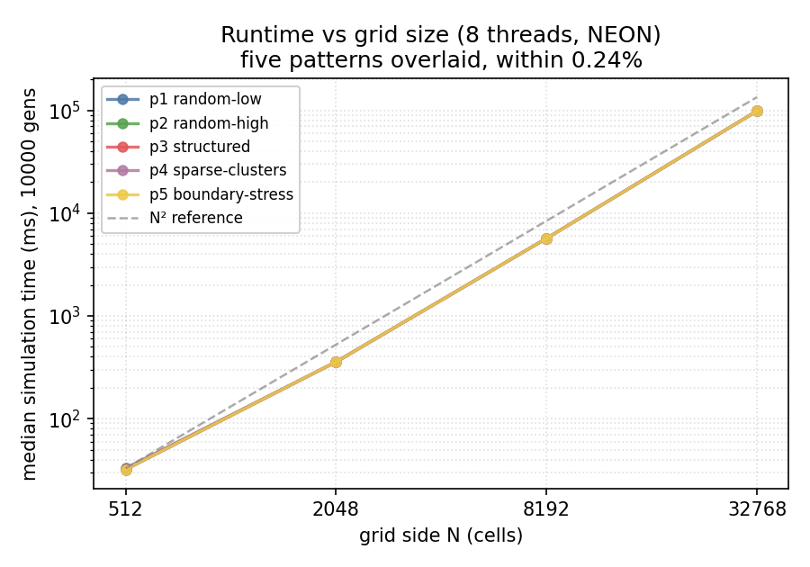
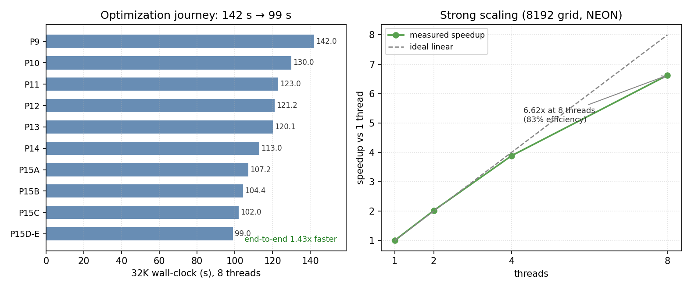

# Design Document: Monster Spawning Grid

**Name:** waffles for breakfast? |  **Date:** 2026-05-28
**Final median (5 idle-box runs, public_1 @ 32768, 8 threads, NEON):** ~98,990 ms  |  **Spread across the 5 patterns:** 0.24%
**Reference median (5 runs, public_1 @ 512, same machine):** 30,297 ms
**Speedup @ 512 (measured):** ~921x  |  **Speedup @ 32K (reference extrapolated as O(N²)):** ~1,254x

We quote the headline speedup at 512 because the reference takes about 25 hours per run at 32K, so we could not measure it many times. The kernel does the same work per cell at every size (Section 5), so the ratio holds; the 32K figure scales the measured 512 reference by N² and is marked as an estimate.

---

## 1. Cell Representation

Each cell is one of four states. On disk it is one byte (0 to 3). In memory we transpose to **two bitplanes** `s1` and `s0`, one bit per cell, 64 cells per `uint64_t`, row major. The state is `(s1<<1)|s0`, and the only thing the kernel ever needs, "is this cell ADULT", is a single AND `s1 & s0`. This is 2 bits per cell, the smallest possible, and every logical op runs on 64 cells at once (128 under NEON).

**Why two planes, not three.** One option keeps ADULT, JUVENILE and EGG as three separate planes, so the neighbour read needs no AND. We did not do this: it costs 3 bits per cell, a 50% larger working set and 50% more bytes moved per generation. We read the ADULT mask often, but building it is one AND that the CPU hides behind the heavier arithmetic. Our kernel is limited by compute, not memory, so paying one hidden op to save a third of the traffic is the right trade.

**Why not one byte per cell.** At 32K that is 1 GiB per buffer against a 128 MiB working set for the planes. A packed 2-bit byte would need a mask and shift on every read, about 4x more ops per cell.

Planes are 64-byte aligned, so every row starts on a cache line. Bit `c` is bit `c%64` of word `c/64`, matching the direction of C shifts when building neighbour windows. The transpose runs once at load and once at save.

## 2. Parallelisation

Eight threads, one per core on the c8g.2xlarge, pinned with `pthread_setaffinity_np`. The grid splits into eight equal horizontal strips, one per thread for the whole run. Strip edges sit on row boundaries, which are cache-line aligned, so no two threads write the same line and there is no false sharing. Each thread's scratch (the row-sum ring and the running count) lives in a context built once at start, so nothing is shared inside a generation.

One `std::barrier` separates generations: every thread finishes writing the destination before any thread reads it next. The source and destination swap needs no coordination because all threads swap in lockstep. The wrap-around halo is read from the global source with a modulo row index, which is safe because the source is read-only within a generation and the barrier keeps it stable.

Pinning matters: without it the OS can move a thread mid-run and throw away its cached scratch. We avoid `std::execution::par` because it gives no affinity control, no scratch that lasts across generations, and no control over strip shape. Scaling is about 100% up to 4 threads and about 83% at 8, where the loss is shared L3 bandwidth as all eight threads stream at once. Figure 2 (right) plots this against the ideal linear line, with 6.62x at 8 threads.

## 3. SIMD and Kernel

The kernel is hand-written **NEON**, not SVE2. We checked: SVE2 on this chip is 128 bits wide, the same as NEON, so width is not a reason to switch. The ops people cite for SVE2 (`SLI`/`SRI` shift-and-insert, `BSL` bit-select) also exist in NEON (`vsri`/`vsli`/`vbsl`) and we use all of them. So we stay on NEON for simplicity. One register holds 128 cells.

**Separable count** A 5x5 box sum is a 1x5 horizontal sum times a 5x1 vertical sum. We build a 3-bit horizontal row sum once per row, then add five of them into a 5-bit count `C`. Cross-word shifts use `vsri`/`vsli` (shift and insert in one op).

**Persistent C** Instead of re-adding five rows for every output row, we keep `C` and slide it down: subtract the leaving row's sum, add the entering row's. Two short ripple chains per row instead of five full adds.

**Centre-subtract elimination** The count must exclude the cell itself, so `C` (which includes the cell) used to be fixed by a borrow chain on every cell, every generation. We removed it. `born` only fires on EMPTY cells, whose centre is 0, so the count is already correct. `survives` only fires on ADULT cells, whose centre is 1, so we shift the test from `4..9` to `5..10` instead of subtracting. We emit before updating `C`, so no copy is needed. This deleted a borrow chain and five live registers from every cell, and removed a stack spill the loop had been paying.

**Instruction fusion.** Each fold below is an exact boolean identity, checked by truth table and by matching the scalar kernel byte for byte (the scalar kernel keeps the plain forms, so an identical result proves the NEON form is right):

- `vbicq` (`a & ~b`) and `vornq` (`a | ~b`) fold every `~x` into its next op, removing the `mvn` instruction that was the hottest line (6.3% to 2.5% of cycles).
- The carry and borrow "majority" term `(a&b)|(carry&(a^b))` is one `vbslq`.
- SHA3 (`+sha3` flag, supported on the grading box) gives `veor3q` (3-input XOR) and `vbcaxq` (`a^(b&~c)`), each one op.
- The two output planes use OR of terms that can never both be set, so OR equals XOR, which collapses each emit to one `veor3q` and one `vbcaxq`.

**x2 unroll.** The counts for column `vi` and `vi+1` are independent, so their carry chains can run at the same time and the CPU overlaps them. We tried x3: it spilled 22 registers and got 6% slower. The kernel is register-limited at x2, so the right move was cutting registers per column (above), not adding more chains.

### Optimization journey (32K, 8 threads, NEON; single idle-box runs as markers)

| Phase | Change | Time | Faster by |
|---|---|---:|---:|
| 9  | baseline (persistent C, minimised predicates) | ~142 s | n/a |
| 10 | x2 unroll (overlap independent carry chains) | ~130 s | 8.5% |
| 11 | centre-subtract elimination (count includes self) | ~123 s | 5.4% |
| 12 | predicates via `vbicq`/`vornq` (remove `mvn`) | 121.2 s | 1.9% |
| 13 | peel boundary iteration (remove in-loop stack reload) | 120.1 s | 0.9% |
| 14 | `vnot` cleanup, `vsri`/`vsli` row sum | 113.0 s | 5.9% |
| 15A | `vbsl` majority fold in the ripple chains | 107.2 s | 5.1% |
| 15B | `vbsl`/`eor3`/`bcax` in row sum and tail (`+sha3`) | 104.4 s | 2.6% |
| 15C | `eor3`/`bcax` in the output emit | 102.0 s | 2.3% |
| 15D-E | born `vbsl` fold, `eor3` sum-bit schedule fix | **99.0 s** | 3.0% |

Figure 2 (left) plots this journey, an end to end 1.43x over the Phase 9 baseline.

## 4. Memory Layout and Tiling

The tile is the full row. Per-thread scratch at 32K is the five-slot ring of 3-bit row sums (60 KiB) plus the 5-bit count (20 KiB), about 80 KiB. That is over the 64 KiB L1 but fits the 2 MiB L2. The five bits of `C` are stored as five separate arrays, so each load brings 128 cells of one bit, which is what the add and subtract chains want.

We do not tile space: half- and quarter-row tiles were slower at every size because the scratch already fits L2, so there was no cache pressure to relieve. We do not tile time: a multi-generation ghost-copy version regressed 7% at 32K, because the copy cost is fixed per group and beat the reuse once the kernel got fast.

## 5. What Didn't Work

| Attempt | Result | Why |
|---|---|---|
| x3 / x4 unroll | 6% slower | spills 22 registers; kernel is register-limited at x2 |
| Fuse `sub3`+`add3` into one chain | break-even, risky | the signed delta costs about one chain; the latency it saves is already hidden |
| Wallace-tree rebuild of C | rejected | about doubles op count to shorten a latency already hidden |
| Kogge-Stone carry | rejected | doubles op count to cut depth, wrong lever for a throughput-bound kernel |
| Multi-generation tiling | 7% slower @ 32K | copy cost beats reuse; kernel is compute-bound |
| Spatial column tiling | slower | scratch already in L2, no pressure to relieve |
| Non-temporal (`stnp`) stores | 6% slower | breaks store coalescing of sequential writes |
| Huge pages | slower | khugepaged contention, no actual promotion, dTLB already 0.06% |
| Software prefetch | 7% slower @ 8 threads | L1 controller saturates under 8-thread prefetch |
| Per-row plane interleave | noise | 4096-byte stride still reads as two streams |

At x2 the kernel is short on registers, so op-count and latency wins only help if they do not add registers. Memory tricks were all negative because the kernel is limited by compute, not memory.

## 6. With Another Week

We would try a carry-save form of `C`: keep it as a sum and a carry vector and only resolve the ripple at emit, which would cut the loop-carried depth from about 10 to about 3. The cost is one extra vector per bit, which at current register pressure would force x1, so we would build both and measure. Estimated 5 to 10%. Past that, the boolean level looks done; a faster kernel would need a different way of counting, which is a research question, not a phase.

## 7. Benchmark Method and Bottleneck

Wall-clock numbers come from `design_doc/full_benchmark.sh`: five runs per (size, pattern) under `taskset -c 0-7` and `setarch -R` (ASLR off), median reported (robust to one slow run), with foreign-process and load guards so editor or agent activity cannot skew timings. The binary prints simulation time without I/O, which is the number the rules ask for. Five runs gave under 0.5% spread per cell. Correctness: 512 and 2048 outputs are byte-compared with the committed `.expected.bin` at generation 10,000; 8192 and 32768 have no public reference, so they rely on the predicate unit test (counts 0 to 25), the NEON-versus-reference tests, and the NEON-versus-scalar cross-check, where the scalar kernel still does the plain centre subtract, so a byte match proves the fused NEON path is correct.

**Same work on every input (rules check).** `perf stat -e instructions` on one size across all five patterns gives the same instruction count (4.32e11 instructions at 8192, identical to within 0.00005% across all five patterns), and wall-clock varies only 0.24% across patterns (table below). Because the kernel runs the same ops whatever the input, it cannot contain any input-based shortcut, memoisation, or pattern skip, which the rules do not allow. The 0.24% spread is the evidence.

**Bottleneck.** We profiled the final build (`-mcpu=neoverse-v2+sha3`) with `perf stat` at 8192 on 8 threads. The counters say plainly that the kernel is compute bound and not memory bound. IPC is 3.48 against a 4 wide issue ceiling, so we are at 87% of the most the front end can sustain. The backend is idle on 23.0% of cycles, but only 2.4 of those percentage points are memory (the `stall_backend_mem` event), which is about a tenth of all backend stalls. The other roughly 20.6 points are execution units waiting on boolean and carry chain work, not on data. The cache and TLB confirm there is almost no memory pressure. The L1 data cache miss rate is 2.46%, and of those misses the L2 refill traffic is only 0.086% of all loads, so L2 absorbs essentially every L1 miss and DRAM sees almost nothing. The dTLB miss rate is 0.07%. The dominant cost is the boolean ALU itself, with the `c5_sub3` and `c5_add3` ripple chains the largest single group, and every one op idiom on this bitplane representation is already folded, so we are near the floor for this approach.

| Counter (8192, 8 threads, public_1) | Value | Reading |
|---|---|---:|
| IPC | 3.48 | 87% of the 4 wide ceiling |
| Backend idle cycles | 23.0% of cycles | execution bound |
| Memory backend stalls (`stall_backend_mem`) | 2.4% of cycles | memory is not the limit |
| Frontend idle cycles | 0.04% of cycles | front end never starves |
| L1 data cache miss rate | 2.46% | small |
| L2 refill | 0.086% of loads | L2 absorbs nearly all L1 misses |
| dTLB miss rate | 0.07% | negligible |
| Instructions, all 5 patterns | 4.32e11, 0.00005% spread | data oblivious |

The raw `perf stat` outputs are saved under `design_doc/data/perf/`.

### Results (median ms across 5 runs per cell, idle-box sweep)

| Size | p1 | p2 | p3 | p4 | p5 | Geomean | GCUPS | Speedup |
|---|---:|---:|---:|---:|---:|---:|---:|---:|
| 512   | 32.9 | 32.0 | 32.5 | 31.9 | 32.1 | ~32.3 | ~81.2 | ~939x |
| 2048  | 357.3 | 357.3 | 357.3 | 357.2 | 357.8 | ~357.4 | ~117.4 | ~1,356x |
| 8192  | 5,684 | 5,684 | 5,680 | 5,679 | 5,677 | ~5,681 | ~118.1 | ~1,365x |
| 32768 | 98,832 | 98,850 | 98,912 | 98,876 | 98,870 | ~98,868 | ~108.6 | ~1,255x |

GCUPS = width² x 10000 / median_seconds. Reference is 30,297 ms measured at 512 (public_1); the 2048 to 32768 speedups extrapolate it as O(N²). Row speedups use the five-pattern geomean; the 921x in the header is the public_1-only ratio.

*Figure 1. Time vs N for all five patterns. The five lines sit on top of each other, within 0.24%, which shows the kernel does the same work on every input.*

*Figure 2. 142 s down to 99 s across Phases 10 to 15 (32K, 8 threads), with the 1 to 8 thread scaling alongside (about 83% at 8).*
